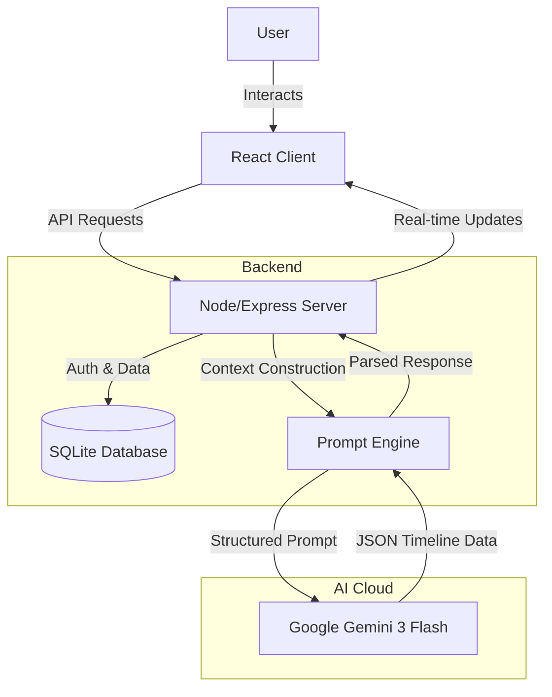

<p align="center">
  
</p>

# 🔮 Usaid - AI-Driven Cognitive Time Simulator

> **Experience the future before you choose it**

Usaid is an AI-powered decision-making tool that simulates multiple future timelines based on your life decisions. Using Google's Gemini AI, it generates personalized scenarios showing potential outcomes across emotional, financial, career, and relationship dimensions.

## ✨ Features

- **🧠 Multi-Timeline Generation** - Get 3-5 distinct future scenarios for any decision using Gemini 3 Flash
- **👤 Personalized Simulations** - AI considers your risk tolerance, priorities, and unique life situation
- **📊 Detailed Metrics** - Visualize emotional, financial, career, and relationship impacts
- **⚖️ Timeline Comparison** - Compare up to 3 timelines side-by-side to weigh trade-offs
- **🔄 Follow-up Decisions** - Inject new decisions to see how they alter futures dynamically
- **🔐 Secure Authentication** - Full sign-up/login flow with JWT security
- **🎨 Premium Experience** - Glassmorphism UI, Dark/Light mode, and immersive sound effects

## 📸 Screenshots

<!-- my screenshots will goes here -->
<table align="center">
  <tr>
    <td align="center"><br /><sub>01</sub></td>
    <td align="center"><br /><sub>02</sub></td>
    <td align="center"><br /><sub>03</sub></td>
  </tr>
  <tr>
    <td align="center"><br /><sub>04</sub></td>
    <td align="center"><br /><sub>05</sub></td>
    <td align="center"><br /><sub>06</sub></td>    
  </tr>
  <tr>
    <td align="center"><br /><sub>07</sub></td>
    <td align="center"><br /><sub>08</sub></td>
    <td align="center"><br /><sub>09</sub></td>
  </tr>
  <tr>
    <td align="center"><br /><sub>10</sub></td>
    <td align="center"><br /><sub>11</sub></td>
    <td align="center"><br /><sub>12</sub></td>
  </tr>
</table>

## 🛠 Tech Stack

**Frontend:** React, TypeScript, Vite, Zustand, React Query, Glassmorphism UI  
**Backend:** Node.js, Express, Prisma (SQLite)  
**AI:** Google Gemini 3 API (Gemini 2.5 for fallback)

## 🏗️ Architecture

The system follows a modern client-server architecture powered by Generative AI:



## 🧠 How We Used Gemini 3

Usaid leverages the advanced reasoning capabilities of **Google Gemini 3** to simulate complex human life paths.

### 1. Context-Aware Prompt Engineering
We don't just ask "what happens next?". We build a rich context object for every request:
- **User Profile**: Risk tolerance, core values, life priorities.
- **Current State**: Age, career, location, relationship status.
- **Decision Matrix**: The specific choice being weighed (e.g., "Quit job to start a startup").

### 2. Multi-Timeline Simulation
Gemini is instructed to generate **3 distinct timeline archetypes** concurrently:
- **The Optimistic Path**: High risk, high reward.
- **The Pragmatic Path**: Balanced, steady growth.
- **The Pessimistic/Safe Path**: Low risk, potential stagnation.

### 3. Structured JSON Output
We utilize Gemini's JSON mode to ensure determinstic, parsable data for our frontend. Every event in the timeline includes:
- `year`: Time offset
- `event`: Description of the event
- `impact_score`: -10 to +10 quantification of impact
- `category`: Financial, Emotional, Career, or Relationship

## 🌍 Potential Impact

### Democratizing Strategic Foresight
Corporate strategists use "Scenario Planning" to make billion-dollar decisions. Usaid brings this military-grade cognitive tool to personal life choices.

### Reducing Decision Paralysis
By making the abstract future *concrete* and *visible*, Usaid reduces anxiety and helping users make faster, more confident life pivots.

### Broad Applicability
- **Career Counseling**: Helping students choose majors.
- **Financial Planning**: Visualizing the lifestyle impact of savings choices.
- **Life Coaching**: Showing clients the trajectory of their habits.

## 🚀 Getting Started

### Prerequisites

- Node.js 18+
- npm or yarn
- Gemini API key ([Get one here](https://aistudio.google.com/apikey))

### Installation

1. **Clone the repository**
   ```bash
   git clone https://github.com/ritikiitg/Usaid.git
   cd Usaid
   ```

2. **Setup the server**
   ```bash
   cd server
   npm install
   cp .env.example .env
   # Edit .env and add your GEMINI_API_KEY
   npx prisma migrate dev
   ```

3. **Setup the client**
   ```bash
   cd ../client
   npm install
   ```

### Running the Application

1. **Start the server** (from `/server`)
   ```bash
   npm run dev
   ```

2. **Start the client** (from `/client`)
   ```bash
   npm run dev
   ```

3. Open http://localhost:5173 in your browser

## 📁 Project Structure

```
usaid/
├── client/                 # React frontend
│   ├── src/
│   │   ├── components/     # Reusable UI components
│   │   ├── pages/          # Page components
│   │   ├── stores/         # Zustand state stores
│   │   ├── services/       # API client
│   │   └── context/        # React contexts
│   └── public/             # Static assets
│
├── server/                 # Express backend
│   ├── src/
│   │   ├── routes/         # API routes
│   │   ├── services/       # Business logic
│   │   ├── middleware/     # Auth & error handling
│   │   └── lib/            # Prisma client
│   └── prisma/             # Database schema
│
└── README.md
```

## 🔑 Environment Variables

### Server (`/server/.env`)

| Variable | Description |
|----------|-------------|
| `PORT` | Server port (default: 3001) |
| `DATABASE_URL` | SQLite database path |
| `JWT_SECRET` | Secret for JWT tokens |
| `JWT_EXPIRES_IN` | Token expiration (e.g., 7d) |
| `GEMINI_API_KEY` | Your Gemini API key |

## 📝 License

Built for the Devpost Hackathon 2026 by **Ritik Raj**

---

*Powered by Google Gemini*
